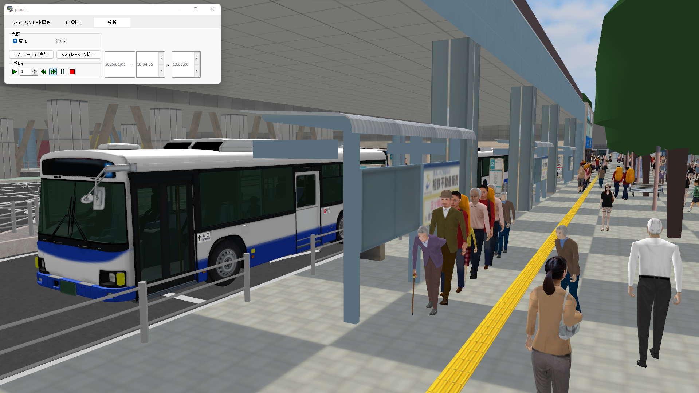

# 輸送計画検討に向けた人流シミュレーションプラグイン（UC-win/Roadプラグイン） <!-- OSSの対象物の名称を記載ください。分かりやすさを重視し、できるだけ日本語で命名ください。英語名称の場合は日本語説明を（）書きで併記ください。 -->

 <!-- OSSの対象物のスクリーンショット（画面表示がない場合にはイメージ画像）を貼り付けください -->

## 更新履歴
| 更新日時 | リリース | 更新内容 |
| ---- | ---- | ---- |
| 2025/10/31 | 1st Release | 初版リリース |

## 1. 概要 <!-- 本リポジトリでOSS化しているソフトウェア・ライブラリについて1文で説明を記載ください -->
本リポジトリでは、Project PLATEAUの令和7年度のユースケース開発業務の一部であるUC25-07「大規模イベントの輸送計画策定に向けた人流シミュレータの開発」について、その成果物である「輸送計画検討に向けた人流シミュレーションプラグイン（UC-win/Roadプラグイン）」のソースコードを公開しています。

「輸送計画検討に向けた人流シミュレーションプラグイン（UC-win/Roadプラグイン）」は、3D都市モデルを活用した人流シミュレーション実行及びシミュレーション結果の出力を行うためのシステムです。

## 2. 「大規模イベントの輸送計画策定に向けた人流シミュレータの開発」について <!-- 「」内にユースケース名称を記載ください。本文は以下のサンプルを参考に記載ください。URLはアクセンチュアにて設定しますので、サンプルそのままでOKです。 -->
「大規模イベントの輸送計画策定に向けた人流シミュレータの開発」では、大規模イベント開催時の輸送計画検討において、公共交通機関の運行ダイヤやバス停の待機列を考慮できる人流シミュレータを活用することで、計画精度の向上と関係者間の合意形成を図ることを目的に開発しました。
本システムの主要な機能は、再現性を高める機能（検証環境生成＋インプット設定＋シミュレーション実行機能）及び分析支援（アウトプットとしてグラフなどを出力できる機能）です。
再現性を高めるための具体的な実装機能として、シミュレーション領域の自動生成、歩行者の発生・退出地点の設定、バス待機列の制御を組み込んだ条件を設定する機能等が存在し、これにより計画策定を行う方が容易に複数シナリオでの人流シミュレーションを実行できます。
また、これらのシミュレーション結果を定量的な視点も含めて詳細に分析するために特定地点、特定時刻での断面交通流やバス乗降結果、待機列形成結果等のアウトプット機能も具備しています。
本システムは、イベント計画・運営団体やその関係者向けのGUIを備えたオープンソースソフトウェアとして開発されています。
本システムの詳細については[技術検証レポート](https://www.mlit.go.jp/plateau/file/libraries/doc/plateau_tech_doc_0030_ver01.pdf)を参照してください。

## 3. 利用手順 <!-- 下記の通り、GitHub Pagesへリンクを記載ください。URLはアクセンチュアにて設定しますので、サンプルそのままでOKです。 -->
本システムの構築手順及び利用手順については[利用チュートリアル](https://r5-plateau-acn.github.io/SolarPotential/)を参照してください。

## 4. システム概要 <!-- OSS化対象のシステムが有する機能を記載ください。 -->
### ①CityGML読込機能
- CityGMLを読み込みます。
- [3D都市モデル標準製品仕様書 第5版](https://www.mlit.go.jp/plateaudocument/#toc0_02)に準拠するCityGMLを読み込んだ場合、②による歩行エリア生成時にCityGMLの属性情報に基づいた歩行エリアが生成されます。

### ②歩行エリア生成・編集機能
- シミュレーションを実施する歩行エリアを生成します。
- 生成された歩行エリアについて、歩行可能・歩行不可等の状態を地点ごとに編集できます。

### ③横断歩道設定機能
- シミュレーションの時間経過に合わせ、入力した値に基づいて信号が切り替わる横断歩道を設定できます。

### ④歩行者の属性・ラベル設定機能
- シミュレーションにおいて発生する歩行者について、モデル、性別、歩行速度や衝突半径等の条件が異なる複数の属性を設定できます。
- 人流に複数のラベルを付与し、ラベルごとに発生する歩行者の属性割合を設定できます。

### ⑤人流発生・退出地点設定機能
- 人流が発生する地点及び退出する地点や、それらの地点について発生人数、目的地分布等の条件を設定できます。
- 公共交通機関の運行ダイヤを基に人流発生・退出を制御することもできます。

### ⑥待機列設定機能
- 歩行者が一定時間滞留する待機列を任意の形状で設定できます。
- 設定した待機列について、歩行者を一定周期で退出させるだけでなく、別途⑤で設定されたバスの運行ダイヤと紐づけて退出させることもできます。

### ⑦シミュレーション集計設定機能
- バス乗降結果、待機列形成結果等の出力の有無や断面交通流の計測範囲等、シミュレーションのログ集計条件を設定できます。

### ⑧シミュレーション環境設定機能
- 日時や天候等、シミュレーションを実行する環境を設定できます。

### ⑨シミュレーション実行機能
- 各種設定に基づいて人流をリアルタイムに計算し、各歩行者の挙動を3次元ベースで可視化します。

### ⑩シミュレーション結果解析・出力機能　
- シミュレーション結果を汎用フォーマット人流データで出力します。また、結果を解析し、ヒートマップや断面交通流のグラフ等を出力します。

## 5. 利用技術

| 種別        | 名称     | バージョン   | 内容                        |
| ----------- | --------|-------------|-----------------------------|
| ソフトウェア | [UC-win/Road](https://www.forum8.co.jp/product/ucwin/road/ucwin-road-1.htm) | 17.2.3 | 3次元リアルタイム・バーチャルリアリティソフト |
|             | [Delphi](https://www.embarcadero.com/jp/products/delphi) | 10.4.2 | 統合開発環境 |
| ライブラリ   | [UC-win/Road SDK](https://www.forum8.co.jp/product/ucwin/road/road-sdk.htm) | 17.2.3 | UC-win/Roadのカスタマイズ用API |
|             | [OpenGL](https://www.opengl.org/) | 3.31 | 3次元描画のためのグラフィックスAPI |
|             | [MF-JSON](https://docs.ogc.org/is/19-045r3/19-045r3.html) | なし | 3次元形状の物体の移動データをJSONを用いて記述する簡潔な記述形式 |

## 6. 動作環境 <!-- 動作環境についての仕様を記載ください。 -->
| 項目               | 最小動作環境                            | 推奨動作環境                                  | 
| ------------------ | -------------------------------------- | ------------------------------------------- | 
| OS                 | Microsoft Windows 10 または 11（64bit） | 同左                                        | 
| CPU                | Intel Core i5以上                      | 同左                                         | 
| GPU                | NVIDIA製GPU                            | NVIDIA Geforce GTX1650以上（4GB以上のメモリ） | 
| メモリ          　  | 16GB以上                                | 32GB以上                                    | 
| ストレージ          | 最低30GB以上の空き容量                  | SSDドライブ 最低60GB以上の空き容量          | 
| ディスプレイ解像度   | 1920×1080以上                          | 同左          　　　　　　　　               | 
| ネットワーク        | 必須                                   | 同左                                        | 

## 7. 本リポジトリのフォルダ構成 <!-- 本GitHub上のソースファイルの構成を記載ください。 -->
| フォルダ名        |　詳細  |
|------------------|-------|
| src/F8CrowdSimPlugin | UC-win/Roadプラグインのソースコード |

## 8. ライセンス <!-- 変更せず、そのまま使うこと。 -->

- ソースコード及び関連ドキュメントの著作権は国土交通省に帰属します。
- 本ドキュメントは[Project PLATEAUのサイトポリシー](https://www.mlit.go.jp/plateau/site-policy/)（CCBY4.0及び政府標準利用規約2.0）に従い提供されています。

## 9. 注意事項 <!-- 変更せず、そのまま使うこと。 -->

- 本リポジトリは参考資料として提供しているものです。動作保証は行っていません。
- 本リポジトリについては予告なく変更又は削除をする可能性があります。
- 本リポジトリの利用により生じた損失及び損害等について、国土交通省はいかなる責任も負わないものとします。

## 10. 参考資料 <!-- 技術検証レポートのURLはアクセンチュアにて記載します。 -->
- 技術検証レポート: https://www.mlit.go.jp/plateau/file/libraries/doc/plateau_tech_doc_0030_ver01.pdf
- PLATEAU WebサイトのUse caseページ「大規模イベントの輸送計画策定に向けた人流シミュレータの開発」: https://www.mlit.go.jp/plateau/use-case/uc25-07/
